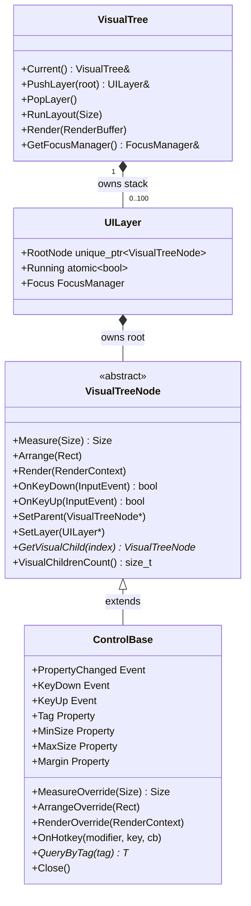

The visual tree system is the runtime backbone of a Terminality application. `VisualTreeNode` defines the abstract contract — layout, rendering, focus, and input — that every widget must fulfill. `UILayer` groups a root node with a `FocusManager` and a running flag, enabling multiple independent trees to coexist as a layer stack. `VisualTree` owns that stack, drives layout and render passes across all layers each frame, and provides the singleton that `HostApplication` uses to coordinate the loop. `ControlBase` is the first concrete implementation of `VisualTreeNode`, adding the reactive property system, events, and the full layout pipeline described in its own reference page.

---

## VisualTreeNode

`VisualTreeNode` is the non-copyable, non-movable abstract base for all objects that can appear in the tree. You do not inherit from it directly in application code; inherit from `ControlBase` instead.

### Tree structure

<AccordionGroup>
  <Accordion title="GetParent() — read the parent pointer">

```cpp
VisualTreeNode* GetParent() const;
```

Returns the parent node, or `nullptr` if this node is the root of its layer or has not yet been attached.

<ResponseField name="return" type="VisualTreeNode*">
  The direct parent node in the visual tree, or `nullptr`.
</ResponseField>

  </Accordion>

  <Accordion title="SetParent(parent) — assign the parent (pure virtual)">

```cpp
virtual void SetParent(VisualTreeNode* parent) = 0;
```

Called by container controls when attaching or detaching a child. Implementations must store the pointer and react appropriately (e.g., fire `PropertyChanged`, call `OnDettachedFromTree`). Passing `nullptr` signals detachment.

<ParamField path="parent" type="VisualTreeNode*">
  The new parent, or `nullptr` to detach.
</ParamField>

  </Accordion>

  <Accordion title="SetLayer(layer) — bind to a UILayer (pure virtual)">

```cpp
virtual void SetLayer(UILayer* layer) = 0;
```

Propagates the owning `UILayer` reference to this node and, in container implementations, recursively to all children. Called when the layer's root node is first set up.

<ParamField path="layer" type="UILayer*">
  The owning layer, or `nullptr` to clear.
</ParamField>

  </Accordion>

  <Accordion title="GetVisualChild(index), VisualChildrenCount() — child access (pure virtual)">

```cpp
virtual VisualTreeNode* GetVisualChild(size_t index) const = 0;
virtual size_t VisualChildrenCount() const = 0;
```

The two methods that constitute the child-access protocol. `VisualChildrenCount()` returns the number of direct children; `GetVisualChild(i)` returns the child at position `i`. Leaf controls return `0` and `nullptr` respectively. Container controls expose their children here.

<ParamField path="index" type="size_t">
  Zero-based child index. Behavior is undefined for `index >= VisualChildrenCount()`.
</ParamField>

<ResponseField name="return (GetVisualChild)" type="VisualTreeNode*">
  The child node at the given index, or `nullptr` from leaf controls.
</ResponseField>

<ResponseField name="return (VisualChildrenCount)" type="size_t">
  Number of direct visual children.
</ResponseField>

  </Accordion>
</AccordionGroup>

### Layout (pure virtual)

The three-phase layout protocol is defined here and implemented in `ControlBase`. The `VisualTree` calls these on each root node every frame.

<AccordionGroup>
  <Accordion title="Measure, Arrange, Render — layout phases">

```cpp
virtual Size Measure(const Size& availableSize) = 0;
virtual void Arrange(const Rect& finalRect) = 0;
virtual void Render(RenderContext& context) = 0;
```

The three layout phases, executed in order each frame for every layer in the stack:

1. **Measure** — nodes report their desired size given the available space.
2. **Arrange** — the tree assigns final rectangles to each node.
3. **Render** — nodes write characters into the `RenderBuffer` via a `RenderContext`.

See [ControlBase — base class for all controls](/api/control-base) for the full implementation description.

  </Accordion>
</AccordionGroup>

### Layout invalidation

<AccordionGroup>
  <Accordion title="InvalidateMeasure, InvalidateArrange, InvalidateVisual">

```cpp
void InvalidateMeasure();
void InvalidateArrange();
void InvalidateVisual();
```

Set the corresponding dirty flag (`measureDirty_`, `arrangeDirty_`, `visualDirty_`). The layout loop checks these flags to decide which phases to rerun. Calling `InvalidateMeasure()` implicitly requires the arrange and visual phases as well.

  </Accordion>

  <Accordion title="IsMeasureDirty, IsArrangeDirty, IsVisualDirty — dirty state queries">

```cpp
bool IsMeasureDirty() const;
bool IsArrangeDirty() const;
bool IsVisualDirty()  const;
```

Return the current dirty state. The `VisualTree` walks the tree checking `IsVisualDirty()` to determine whether a render pass is necessary.

  </Accordion>
</AccordionGroup>

### Attachment state

<AccordionGroup>
  <Accordion title="IsAttached, OnAttachedToTree, OnDettachedFromTree">

```cpp
bool IsAttached() const;
virtual void OnAttachedToTree();
virtual void OnDettachedFromTree();
```

`IsAttached()` returns `true` once the node has been added to a live tree. The two virtual callbacks fire when attachment state changes and can be overridden by subclasses to register or release resources.

  </Accordion>
</AccordionGroup>

### Focus management

<AccordionGroup>
  <Accordion title="IsFocusable, IsTabStop, GetTabIndex — focus queries">

```cpp
virtual bool IsFocusable() const;
virtual bool IsTabStop()   const;
virtual int  GetTabIndex() const;
```

Query the focus configuration set by the corresponding setters. `IsFocusable()` defaults to `true`; a non-focusable node is skipped by the focus manager entirely.

  </Accordion>

  <Accordion title="SetFocusable, SetTabStop, SetTabIndex — focus configuration (pure virtual)">

```cpp
virtual void SetFocusable(bool value) = 0;
virtual void SetTabStop(bool value)   = 0;
virtual void SetTabIndex(int value)   = 0;
```

Configure keyboard focus participation. Implemented by `ControlBase` to write to the protected fields and fire `PropertyChanged`.

  </Accordion>

  <Accordion title="OnGotFocus, OnLostFocus — focus events">

```cpp
virtual void OnGotFocus();
virtual void OnLostFocus();
```

Called by `FocusManager` when this node gains or loses keyboard focus. The default implementations set `focused_` and call `InvalidateVisual()` so the focused/unfocused color pair is applied immediately. Override to add custom focus behavior.

  </Accordion>

  <Accordion title="MoveFocusNext(direction, modifiers) — programmatic focus movement">

```cpp
virtual bool MoveFocusNext(Direction direction, InputModifier modifiers = InputModifier::None);
```

Asks the `FocusManager` to move focus to the next focusable node in `direction`. The `ControlBase` default `OnKeyDown` calls `PopFocus` (which delegates here) when arrow keys or Tab/Shift-Tab are pressed. Override in container controls to implement custom traversal.

<ParamField path="direction" type="Direction" required>
  One of `Direction::Up`, `Direction::Down`, `Direction::Left`, `Direction::Right`, `Direction::Next`, `Direction::Previous`.
</ParamField>

<ParamField path="modifiers" type="InputModifier">
  Active modifier keys at the time of the keypress. Defaults to `InputModifier::None`.
</ParamField>

<ResponseField name="return" type="bool">
  `true` if focus was successfully moved.
</ResponseField>

  </Accordion>
</AccordionGroup>

### Input handling

<AccordionGroup>
  <Accordion title="OnKeyDown(input), OnKeyUp(input) — keyboard dispatch (pure virtual)">

```cpp
virtual bool OnKeyDown(InputEvent input) = 0;
virtual bool OnKeyUp(InputEvent input)   = 0;
```

The UI loop calls `OnKeyDown` or `OnKeyUp` on the currently focused node. If the call returns `false`, the loop walks up `GetParent()` and tries the parent, enabling event bubbling. Implementations should return `true` if they consumed the event.

<ParamField path="input" type="InputEvent" required>
  The keyboard event, carrying `Key`, `Modifier`, and `Pressed`.
</ParamField>

<ResponseField name="return" type="bool">
  `true` to stop bubbling; `false` to pass the event up to the parent.
</ResponseField>

  </Accordion>
</AccordionGroup>

### Size and position accessors

<AccordionGroup>
  <Accordion title="GetActualSize, GetArrangedRect — post-layout geometry">

```cpp
Size GetActualSize()    const;
Rect GetArrangedRect()  const;
```

Return the size computed during `Measure` and the rectangle assigned during `Arrange`. These values are only meaningful after a layout pass has completed for the current frame.

  </Accordion>
</AccordionGroup>

---

## UILayer

`UILayer` groups a root node, its `FocusManager`, and an atomic running flag into a single unit that the layer stack owns. Each call to `VisualTree::PushLayer()` creates a new `UILayer`; `NestUILoop` drives one layer at a time.

```cpp
struct UILayer
{
    std::unique_ptr<VisualTreeNode> RootNode;
    std::atomic<bool>               Running { false };
    FocusManager                    Focus;
    int32_t                         Index;
};
```

| Field | Type | Description |
|---|---|---|
| `RootNode` | `unique_ptr<VisualTreeNode>` | The root control for this layer. Owns the entire subtree. |
| `Running` | `atomic<bool>` | The loop condition. Set to `false` (via `Close()` or `RequestStop()`) to exit the nested loop. |
| `Focus` | `FocusManager` | Per-layer focus state. The focused node receives all keyboard events while this layer is active. |
| `Index` | `int32_t` | Position of this layer in the stack (assigned by `PushLayer`). |

`UILayer` is non-copyable and non-movable. Construct it only through `VisualTree::PushLayer()`.

---

## VisualTree

`VisualTree` is the singleton that owns the layer stack and coordinates layout and rendering across all active layers.

### Singleton access

```cpp
static VisualTree& Current();
```

Returns the process-wide `VisualTree` instance. Use this to push/pop layers, query layer count, or access the `FocusManager` from outside the render pipeline.

### Layer stack

<AccordionGroup>
  <Accordion title="PushLayer(root) → UILayer& — add an overlay layer">

```cpp
UILayer& PushLayer(std::unique_ptr<VisualTreeNode> layerRoot);
```

Moves `layerRoot` into a new `UILayer`, appends it to the layer stack, sets initial focus to the root node, and marks the tree as dirty for a full re-render. Returns a reference to the new layer so the caller can pass it to `NestUILoop`.

<ParamField path="layerRoot" type="std::unique_ptr<VisualTreeNode>" required>
  The root node of the new layer. Ownership transfers to `VisualTree`.
</ParamField>

<ResponseField name="return" type="UILayer&">
  Reference to the newly created layer on the stack.
</ResponseField>

  </Accordion>

  <Accordion title="PopLayer() — remove the top layer">

```cpp
void PopLayer();
```

Stops the top layer's running flag, removes it from the stack, and marks the tree dirty. Does nothing if only one layer remains.

  </Accordion>

  <Accordion title="LayerCount() — number of active layers">

```cpp
std::size_t LayerCount();
```

Returns the number of layers currently on the stack.

  </Accordion>

  <Accordion title="Root() — bottom layer root node">

```cpp
VisualTreeNode* Root() const;
```

Returns the root node of the first (base) layer, or `nullptr` if the stack is empty. This is the main application widget passed to `RunUILoop`.

  </Accordion>

  <Accordion title="PeekLayer() — top layer root node">

```cpp
VisualTreeNode* PeekLayer() const;
```

Returns the root node of the topmost layer — the one currently receiving input and being rendered — or `nullptr` if the stack is empty.

  </Accordion>
</AccordionGroup>

### Focus

<AccordionGroup>
  <Accordion title="GetFocusManager() — access the top layer's focus state">

```cpp
FocusManager& GetFocusManager();
```

Returns the `FocusManager` for the topmost layer. Throws if the stack is empty. The UI loop calls this to dispatch keyboard events to the currently focused node.

<ResponseField name="return" type="FocusManager&">
  Focus manager for the active layer.
</ResponseField>

  </Accordion>
</AccordionGroup>

### Layout and rendering

<AccordionGroup>
  <Accordion title="RunLayout(viewportSize) — measure and arrange all layers">

```cpp
void RunLayout(const Size& viewportSize);
```

Calls `Measure` and then `Arrange` on each layer's root node, passing the full viewport rectangle. Also collects dirty-visual flags from the traversal. The UI loop calls this before every render attempt.

<ParamField path="viewportSize" type="const Size&" required>
  Current terminal dimensions from `HostBackend::QueryViewportSize()`.
</ParamField>

  </Accordion>

  <Accordion title="Render(buffer) — composite render of the layer stack">

```cpp
void Render(RenderBuffer& buffer);
```

Renders the layer stack into `buffer` if `HasDirtyVisual()` is `true`, then clears the dirty flag. The render is a **composite**: the tree scans from the topmost layer downward for the first layer whose root covers the whole viewport *and actually paints it* (a non-transparent background), renders from that layer up to the topmost — newer layers draw over older ones — and skips anything below as fully occluded. A full-viewport layer with a transparent background does **not** count as covering, so live content beneath a centered-dialog overlay keeps rendering. If no layer covers the viewport, everything renders.

<ParamField path="buffer" type="RenderBuffer&" required>
  The render buffer to draw into. The buffer is then diff-rendered to stdout by the UI loop.
</ParamField>

  </Accordion>

  <Accordion title="Invalidate(dirtyRect) — mark a region for redraw">

```cpp
void Invalidate(const Rect& dirtyRect);
```

Marks a rectangular region of the viewport as needing redraw. The dirty region is union-merged with any previously invalidated area.

<ParamField path="dirtyRect" type="const Rect&" required>
  The rectangle in viewport coordinates that needs to be redrawn.
</ParamField>

  </Accordion>

  <Accordion title="HasDirtyVisual() — check if a render pass is needed">

```cpp
bool HasDirtyVisual() const;
```

Returns `true` if any node has signalled a visual change since the last `Render` call. The UI loop checks this before calling `Render` to avoid unnecessary work.

  </Accordion>
</AccordionGroup>

---

## Relationship between VisualTreeNode, UILayer, and ControlBase



`VisualTreeNode` defines the protocol; `ControlBase` provides the full implementation with properties, events, and hotkeys. `UILayer` bundles a root node with per-layer focus state. `VisualTree` manages the layer stack and drives the frame loop.
